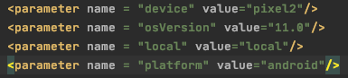

# Lojong App Tests

Projeto para automação de testes mobile, Android e iOS, no aplicativo Lojong.

## Installation

Para instalar as dependências, basta executar o arquivo [install_dependencies.sh](config/install_dependencies.sh).

```sh
bash install_dependencies.sh 
```

## Executar um teste
Em qualquer tipo de execução devemos passar os argumetos:

| Argumento | Valores             | Porquê?                                                |
|  ------   | ------              |     ------                                             |
|-Dplatform=|ios, android(default)| define a plataforma que executa o teste                |
|-Dlocal=   |df, local(default)   | define se será executado localmente ou no BrowserStack |

> Quando a execução for ```-Dlocal=local``` não é necessário que ```appium``` esteja rodando, 
pois ele é inicializado automaticamente pelo projeto.


> Lembrar de sempre alterar o arquivo ```Capabilities.java``` com as seuas opções (```nome do device, versão do SO, etc```).

### Configurar uma exeução na IDE:

Escolher o arquivo de teste que será executado e os argumentos:
 


### Via sh (para rodar em uma pipeline):

Antes de executar deve-se criar as suites de teste
É possível criar suites de testes, organizando pelo nome da suite e os arquivos de testes dentro,
seguindo modelo do arquivo XML [testng.xml](testng.xml). 

##### Execurtando uma suite:
 
```sh
mvn test -DsuiteXmlFile=testng.xml -DskitTests=false -Dplatform=android -Dlocal=local
```

## Contributing
Pull requests são bem-vindos.

Abra seu PR, e vamos analisar suas alterações!

## Autor
[Eduardo Finotti](https://www.linkedin.com/in/eduardo-finotti/)